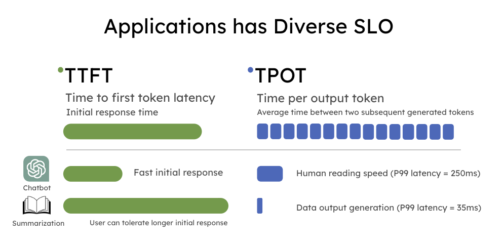

+++
title = "TODO DistServe Title"
date = 2024-03-17T12:00:00-08:00
authors = ["Yinmin Zhong", "Shengyu Liu", "Junda Chen", "Jianbo Hu", "Yibo Zhu", "Xuanzhe Liu", "Xin Jin", "Hao Zhang"]
author = Yinmin Zhong, Shengyu Liu, Junda Chen, Jianbo Hu, Yibo Zhu, Xuanzhe Liu, Xin Jin, Hao Zhang
ShowReadingTime = true
draft = true
[cover]
    image = "img/distserve_anime.gif"
    alt = "DistServe"
    caption = "Animation for Prefill/Decode Disaggregation"
+++





**TLDR** **TODO!!**

LLM apps today have diverse latency requirements. For example, a chatbot may require a fast initial response (e.g. under 0.2 seconds) but moderate speed in decoding (only need to match human reading speed), whereas code completion requires a fast end-to-end generation time for real-time code suggestions. 

In this blogpost, we show existing serving systems that optimize \*throughput\* are not optimal under latency criteria because of prefill-decode interference and coupled parallelism. 

We advocate goodput, the number of completed requests per second adhering to the Service Level Objective (SLO), as an improved measure of LLM serving performance to account for both cost and user satisfaction.

prefill-decode disaggreation, aka speating prefill from decode into different GPUs.

To optimize goodput, we introduce prefill-decode disaggregation and build DistServe, which achieves up to 4.48x goodput or 10.2x tighter SLO compared to SOTA serving systems, while staying within tight latency constraints. We are integrating DistServe with vLLM to bring the technique to the community.


## Background: Throughput vs. Goodput 

Large language models (LLMs) are changing how the industry adopts AI technology in their services, but the cost of LLM serving remains high. To reduce serving costs, many companies today focus on maximizing the overall LLM serving system **throughput, i.e., the number of requests served per second (or rps)**, as a proxy to minimize **dollar per request ($/req)**. Almost all popular LLM serving engines like [vLLM](https://blog.vllm.ai/2023/06/20/vllm.html) and [TensorRT-LLM](https://github.com/NVIDIA/TensorRT-LLM) use throughput as the only metric to compare performance with each other.

In reality, downstream applications come in different flavors. These LLM-based applications may have different latency requirements for user experience, hence dramatically different [**service level objectives** (**SLO**)](https://en.wikipedia.org/wiki/Service-level_objective) to satisfy. The most widely used SLO in LLM services are:

- Time to first token latency (**TTFT**): measuring the time taken for the LLM to respond the first generated token to the user
- Time per output token (**TPOT**): measuring the average latency between two subsequent generated tokens

