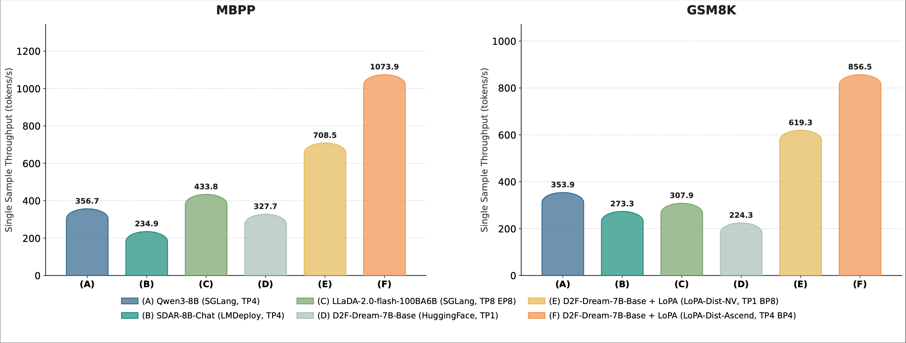

+++
title = "LoPA: Scaling dLLM Inference via Lookahead Parallel Decoding"
date = 2025-12-18
authors = ["Chenkai Xu*", "Yijie Jin*", "Jiajun Li", "Yi Tu", "Guoping Long", "Dandan Tu", "Mingcong Song", "Hongjie Si", "Tianqi Hou", "Junchi Yan", "Zhijie Deng †"]
author = "Chenkai Xu*, Yijie Jin*, Jiajun Li, Yi Tu, Guoping Long, Dandan Tu, Mingcong Song, Hongjie Si, Tianqi Hou, Junchi Yan, Zhijie Deng †"
ShowReadingTime = true
draft = false
summary = "We introduce the Lookahead Parallel Decoding (LoPA) algorithm for diffusion large language models (dLLMs) inference, enabling up to 10.1 tokens per forward pass."

[cover]
      image = "blogs/lopa/image/figure3.png"
      alt = "LoPA Performance"
      caption = "Overview of Lookahead Parallel Decoding (LoPA)."
+++

<strong>Github:</strong> <a href="https://github.com/zhijie-group/LoPA">https://github.com/zhijie-group/LoPA</a>

We introduce the Lookahead Parallel Decoding (LoPA) algorithm for diffusion large language models (dLLMs) inference. LoPA enables up to 10.1 tokens per forward pass (TPF) for state-of-the-art dLLMs—without compromising predictive performance. This represents an unprecedented degree of parallelism, a capability unmatched by previous dLLM decoding methods. Under multi-device deployment, our specialized system LoPA-Dist achieves a single-sample throughput of 1073.9 tokens per second.

Figure 1. Throughput performance of LoPA under guaranteed inference speed. LoPA accelerates the single-sample throughput for D2F-Dream to up to 1073.9 and 774.1 tokens/s on MBPP and GSM8K respectively, significantly outperforming baselines.

<h2>Background</h2>

DLLMs show significant potential for high-speed inference, yet current confidence-driven decoding strategies are constrained by limited parallelism—typically achieving only 1-3 TPF on math and coding tasks [2, 3]. Our investigation identifies a key insight: during dLLM inference, the degree of parallelism fluctuates sharply with the prediction confidence, which is heavily influenced by the Token Filling Order (TFO). Consequently, standard strategies that greedily prioritize currently high-confidence positions may lead to suboptimal trajectories. To address this, we propose Lookahead Parallel Decoding (LoPA), a training-free, plug-and-play algorithm designed to actively explore superior TFOs to unlock higher parallelism.

<h2>Methodology</h2>

This section first explains the foundational Confidence-Driven Sampling used in regular dLLM inference [2, 3, 4] and then elaborates on LoPA.

Figure 2. Scaling analysis of LoPA on D2F-Dream with varying branch counts. The results illustrate that LoPA effectively scales the TPF of D2F to a peak exceeding 10, thereby significantly reducing the total number of decoding steps.

<h3>Preliminary: Confidence-Driven Sampling for dLLMs</h3>

Confidence-driven sampling is a prevalent paradigm for current dLLMs to boost parallelism, adopted in models such as Fast-dLLM [2], D2F [3], and SDAR [4]. Specifically, given a sequence $x_t$ with a set of masked positions $M_t$, the dLLM model $p_{\theta}$ outputs a predictive distribution $p_{\theta}(\cdot \mid x_t)$. A candidate sequence $\hat{x}_0 \sim p_{\theta}(\cdot \mid x_t)$ is sampled, and a confidence function, $\text{Conf}(\cdot)$, assigns a score to each position $i \in M_t$. The set of positions to fill, $I_{fill}$, is then determined as:

$$I_{fill} = \begin{cases} \{i \in M_t \mid \text{Conf}(i) > \tau\} & \text{if } \{i \in M_t \mid \text{Conf}(i) > \tau\} \neq \emptyset \\ \{\arg\max_{i \in M_t} \text{Conf}(i)\} & \text{otherwise} \end{cases}$$

The algorithm then accepts the predictions according to $I_{fill}$ and moves to the next iteration.

<h2>LoPA</h2>

Figure 3. Overview of Lookahead Parallel Decoding (LoPA). In each iteration, LoPA generates a anchor branch alongside multiple lookahead branches (e.g., B1, . . . , Bk ) by independently sampling high-confidence positions from the baseline’s unfilled set. A branch confidence verification mechanism then evaluates all branches in parallel within a single forward pass, selecting the optimal path to maximize future parallelism.

As shown in Figure 3, in every decoding iteration, LoPA looks ahead at multiple TFOs, yielding multiple sampling branches, and then identifies the branch with superior future parallel decoding potential.

<h3>Look ahead Multiple TFOs in Parallel</h3>

LoPA operates by generating multiple branches. First, it constructs an Anchor Branch ($B_0$) using the standard confidence-driven strategy (filling positions in $I_{fill}$).

LoPA is designed to explore one step further than this anchor branch. To ensure effective and reliable exploration, we prioritize sampling tokens with higher confidence, a strategy that has been proved in Fast-dLLM [2] to yield more stable predictions. Specifically, in addition to $B_0$, we generate $k$ competitive Lookahead Branches. We identify the top-$k$ positions from the anchor branch's unfilled set $M_{B_0}$ that possess the highest confidence scores. For each identified position, we sample it independently to create a distinct branch. This results in a set of $k$ new branches $\{B_1, \dots, B_k\}$, each with its own sequence $x_{B_j}$ and unfilled set $M_{B_j}$.

<h3>Branch Confidence-based Verification</h3>

Inspired by DeepConf [5], we design a branch confidence metric to guide the selection among candidate decoding paths. Formally, the confidence of a branch $B_j$ is defined as the average prediction confidence over its remaining unfilled positions $M_{B_j}$:

$$C(B_j) = \frac{1}{|M_{B_j}|} \sum_{i \in M_{B_j}} \text{Conf}(i)$$

A higher branch confidence indicates that more unfilled positions are likely to be accepted in the very next decoding step. This directly increases the number of tokens filled per iteration, thereby enhancing the overall parallelism. Beyond this mean confidence, branch confidence can also be quantified by other methods [5], such as applying a sliding window to assess local quality or averaging confidence over the least confident segment to identify weak links.

This verification mechanism offers distinct advantages. First, all candidate branches (Anchor + Lookahead) can be packed and verified within a single forward pass, with custom attention masks ensuring independent computation for each branch. Second, the logits computed during branch evaluation are directly reused in the next decoding step, eliminating the need for additional forward passes.

<h3>Application: integration with D2F</h3>

LoPA integrates seamlessly with D2F [3], the first open-source diffusion language model whose inference throughput surpasses that of autoregressive (AR) models. Our application of LoPA to D2F incorporates two key enhancements:

<ul>
<li><strong>Parallel Exploration in a Decoding Window:</strong> We treat all active blocks in D2F's pipeline as a single window where LoPA's branch exploration and lookahead verification operate. Replacing the original block-level causal attention with a full attention mechanism within this window reduces implementation complexity and enhances computational performance.</li>
<li><strong>System Integration and Performance:</strong> On the D2F-Dream model, LoPA achieves a TPF of up to 10.1. To leverage this parallelism, we developed a specialized multi-device inference system where LoPA achieves a throughput of 1073.86 tokens per second.</li>
</ul>

<h2>Results</h2>

<h3>Scaling Analysis of Branch Count</h3>

We analyzed the impact of the competitive branch count (k) on TPF and quality using D2F models fine-tuned on Dream[6] and DiffuCoder[7]. Results show TPF consistently improves with k; however, excessive k introduces fluctuations, attributed to the model prioritizing future confidence over local optimality. These results point to an optimal trade-off, where a carefully chosen k can maximize TPF while preserving quality.

Figure 4. Scaling Curves of LoPA. LoPA scales the TPF for D2F-Dream and D2F-DiffuCoder to up to 10.1 and 8.3 on GSM8k and HumanEval+ respectively, with comparable performance.

As shown in the Figure 4, on GSM8K, LoPA scales the TPF of D2F-Dream to 10.1 while maintaining a score (73.8) superior to the Dream baseline (72.6). on HumanEval+, LoPA scales the TPF of D2F-DiffuCoder to 8.3 with marginal performance degradation, demonstrating a clear speed-accuracy trade-off.

Tables 1 and 2 below confirm this efficacy across multiple benchmarks.

<table style="margin: 0 auto; text-align: center; border-collapse: collapse; display: inline-table; width: auto !important;">
<caption>Table 1. Accuracy-preserving parallelism scaling of Dream on multiple benchmarks across multiple branches. TPF denotes Tokens Per Forward pass. LoPA significantly scales the TPF of D2F-Dream while maintaining or exceeding baseline scores.</caption>
<thead>
<tr style="border-bottom: 2px solid #ddd;">
<th rowspan="2" style="padding: 10px;">Model</th>
<th rowspan="2" style="padding: 10px;">Decoding algo</th>
<th colspan="2" style="padding: 10px;">MBPP 3-shot</th>
<th colspan="2" style="padding: 10px;">Math 4-shot</th>
<th colspan="2" style="padding: 10px;">HumanEval 0-shot</th>
<th colspan="2" style="padding: 10px;">GSM8K 4-shot</th>
</tr>
<tr style="border-bottom: 2px solid #ddd;">
<th style="padding: 10px;">TPF</th>
<th style="padding: 10px;">Score</th>
<th style="padding: 10px;">TPF</th>
<th style="padding: 10px;">Score</th>
<th style="padding: 10px;">TPF</th>
<th style="padding: 10px;">Score</th>
<th style="padding: 10px;">TPF</th>
<th style="padding: 10px;">Score</th>
</tr>
</thead>
<tbody>
<tr>
<td style="padding: 8px;">Dream</td>
<td style="padding: 8px;">vanilla</td>
<td style="padding: 8px;">1</td>
<td style="padding: 8px;"><b>56.2</b></td>
<td style="padding: 8px;">1</td>
<td style="padding: 8px;">33.7</td>
<td style="padding: 8px;">1</td>
<td style="padding: 8px;">55.5</td>
<td style="padding: 8px;">1</td>
<td style="padding: 8px;">72.6</td>
</tr>
<tr>
<td style="padding: 8px;">Dream</td>
<td style="padding: 8px;">Fast-dLLM</td>
<td style="padding: 8px;">1.9</td>
<td style="padding: 8px;">55.6</td>
<td style="padding: 8px;">1.9</td>
<td style="padding: 8px;"><b>37.6</b></td>
<td style="padding: 8px;">1.8</td>
<td style="padding: 8px;">55.5</td>
<td style="padding: 8px;">2.1</td>
<td style="padding: 8px;">72.6</td>
</tr>
<tr>
<td style="padding: 8px;">Dream</td>
<td style="padding: 8px;">LoPA</td>
<td style="padding: 8px;">3.3</td>
<td style="padding: 8px;">54.8</td>
<td style="padding: 8px;">3.4</td>
<td style="padding: 8px;">37.0</td>
<td style="padding: 8px;">2.9</td>
<td style="padding: 8px;">53</td>
<td style="padding: 8px;">3.1</td>
<td style="padding: 8px;">73.3</td>
</tr>
<tr>
<td style="padding: 8px;">D2F-Dream</td>
<td style="padding: 8px;">vanilla</td>
<td style="padding: 8px;">2.3</td>
<td style="padding: 8px;">53.8</td>
<td style="padding: 8px;">2.6</td>
<td style="padding: 8px;">36.8</td>
<td style="padding: 8px;">2.5</td>
<td style="padding: 8px;"><b>56.1</b></td>
<td style="padding: 8px;">3.1</td>
<td style="padding: 8px;"><b>78.5</b></td>
</tr>
<tr style="border-bottom: 1px solid #ddd;">
<td style="padding: 8px;">D2F-Dream</td>
<td style="padding: 8px;">LoPA</td>
<td style="padding: 8px;"><b>5.4</b></td>
<td style="padding: 8px;">56.0</td>
<td style="padding: 8px;"><b>8.0</b></td>
<td style="padding: 8px;">35.2</td>
<td style="padding: 8px;"><b>6.3</b></td>
<td style="padding: 8px;"><b>56.1</b></td>
<td style="padding: 8px;"><b>10.1</b></td>
<td style="padding: 8px;">73.8</td>
</tr>
</tbody>
</table>

<table style="margin: 0 auto; text-align: center; border-collapse: collapse; display: inline-table; width: auto !important;">
<caption>Table 2. Accuracy-preserving parallelism scaling of DiffuCoder on MBPP+ and HumanEval+ benchmarks. LoPA boosts TPF by nearly 4× compared to the vanilla D2F baseline with minimal impact on generation quality.</caption>
<thead>
<tr style="border-bottom: 2px solid #ddd;">
<th rowspan="2" style="padding: 10px;">Model</th>
<th rowspan="2" style="padding: 10px;">Decoding algo</th>
<th colspan="2" style="padding: 10px;">MBPP++ 0-shot</th>
<th colspan="2" style="padding: 10px;">HumanEval++ 0-shot</th>
</tr>
<tr style="border-bottom: 2px solid #ddd;">
<th style="padding: 10px;">TPF</th>
<th style="padding: 10px;">Score</th>
<th style="padding: 10px;">TPF</th>
<th style="padding: 10px;">Score</th>
</tr>
</thead>
<tbody>
<tr>
<td style="padding: 8px;">DiffuCoder</td>
<td style="padding: 8px;">vanilla</td>
<td style="padding: 8px;">1</td>
<td style="padding: 8px;"><b>61.9</b></td>
<td style="padding: 8px;">1</td>
<td style="padding: 8px;">65.2</td>
</tr>
<tr>
<td style="padding: 8px;">D2F-Diffucoder</td>
<td style="padding: 8px;">vanilla</td>
<td style="padding: 8px;">2.2</td>
<td style="padding: 8px;"><b>61.9</b></td>
<td style="padding: 8px;">2.2</td>
<td style="padding: 8px;"><b>65.9</b></td>
</tr>
<tr style="border-bottom: 1px solid #ddd;">
<td style="padding: 8px;">D2F-Diffucoder</td>
<td style="padding: 8px;">LoPA</td>
<td style="padding: 8px;"><b>6.7</b></td>
<td style="padding: 8px;">61.6</td>
<td style="padding: 8px;"><b>8.3</b></td>
<td style="padding: 8px;">64.0</td>
</tr>
</tbody>
</table>

Figure 5. Overview of LoPA Branch Parallel Distributed Inference System Design. A key distinction lies in the KV cache management protocol tailored for different backends: LoPA-Dist-NV utilizes a robust two-phase update mechanism to ensure consistency, whereas LoPA-Dist-Ascend adopts a streamlined single-phase update strategy for optimized serving efficiency.

<h2>System Throughput and Scalability</h2>

To fully exploit LoPA’s parallelism, we designed LoPA-Dist, a distributed inference system utilizing Branch Parallelism (BP).

The system distributes candidate branches across multiple GPUs for concurrent processing. We provide two specialized implementations:

<ul>
<li>LoPA-Dist-NV (CUDA): Optimized for low latency using static KV cache and a two-phase update protocol (Pre-Write and Commit-Winner-Cache) to ensure consistency.</li>
<li>LoPA-Dist-Ascend (Ascend 910C): Optimized for high throughput using hybrid parallelism and graph compilation to fuse element-wise operations.</li>
</ul>

As shown in Table 3, this design achieves near-linear scalability. On the Ascend platform, LoPA-Dist achieves a peak throughput of 1073.86 tokens/s.

<table style="margin: 0 auto; text-align: center; border-collapse: collapse; display: inline-table; width: auto !important;">
<caption>Table 3. System performance of D2F-Dream under guaranteed inference speed. The results demonstrate that our system efficiently translates algorithmic parallelism (high TPF) into significant wall-clock acceleration, achieving high Parallelism Utilization (PU) and average throughputs exceeding 1000 tokens/s on the specialized LoPA-Dist-Ascend engine.</caption>
<thead>
<tr style="border-bottom: 2px solid #ddd;">
<th rowspan="2" style="padding: 10px;">Model</th>
<th rowspan="2" style="padding: 10px;">Platform</th>
<th colspan="4" style="padding: 10px;">MBPP</th>
<th colspan="4" style="padding: 10px;">GSM8K</th>
</tr>
<tr style="border-bottom: 2px solid #ddd;">
<th style="padding: 10px;">Avg TPS</th>
<th style="padding: 10px;">Max TPS</th>
<th style="padding: 10px;">TPF</th>
<th style="padding: 10px;">Latency</th>
<th style="padding: 10px;">Avg TPS</th>
<th style="padding: 10px;">Max TPS</th>
<th style="padding: 10px;">TPF</th>
<th style="padding: 10px;">Latency</th>
</tr>
</thead>
<tbody>
<tr>
<td rowspan="2" style="padding: 8px;">D2F-Dream-Base</td>
<td style="padding: 8px;">LoPA-Dist-NV</td>
<td style="padding: 8px;">708.48</td>
<td style="padding: 8px;">1470.95</td>
<td style="padding: 8px;"><b>15.55</b></td>
<td style="padding: 8px;">0.74</td>
<td style="padding: 8px;">619.33</td>
<td style="padding: 8px;">1299.25</td>
<td style="padding: 8px;"><b>13.16</b></td>
<td style="padding: 8px;">0.85</td>
</tr>
<tr>
<td style="padding: 8px;">LoPA-Dist-Ascend</td>
<td style="padding: 8px;"><b>1073.86</b></td>
<td style="padding: 8px;"><b>2400.12</b></td>
<td style="padding: 8px;">11.92</td>
<td style="padding: 8px;"><b>0.78</b></td>
<td style="padding: 8px;"><b>856.46</b></td>
<td style="padding: 8px;"><b>2751.61</b></td>
<td style="padding: 8px;">9.34</td>
<td style="padding: 8px;"><b>0.75</b></td>
</tr>
<tr>
<td rowspan="2" style="padding: 8px;">D2F-Dream-Instruct</td>
<td style="padding: 8px;">LoPA-Dist-NV</td>
<td style="padding: 8px;">636.55</td>
<td style="padding: 8px;">1811.71</td>
<td style="padding: 8px;"><b>9.52</b></td>
<td style="padding: 8px;">0.14</td>
<td style="padding: 8px;">609.90</td>
<td style="padding: 8px;">1407.56</td>
<td style="padding: 8px;"><b>11.42</b></td>
<td style="padding: 8px;">0.26</td>
</tr>
<tr style="border-bottom: 1px solid #ddd;">
<td style="padding: 8px;">LoPA-Dist-Ascend</td>
<td style="padding: 8px;"><b>896.21</b></td>
<td style="padding: 8px;"><b>2586.73</b></td>
<td style="padding: 8px;">8.64</td>
<td style="padding: 8px;"><b>0.11</b></td>
<td style="padding: 8px;"><b>897.10</b></td>
<td style="padding: 8px;"><b>1868.16</b></td>
<td style="padding: 8px;">9.30</td>
<td style="padding: 8px;"><b>0.21</b></td>
</tr>
</tbody>
</table>

<table style="margin: 0 auto; text-align: center; border-collapse: collapse; display: inline-table; width: auto !important;">
<caption>Table 4. Performance ablation study of D2F-Dream models on different platforms, corresponding to settings S1-S18.</caption>
<thead>
<tr style="border-bottom: 2px solid #ddd;">
<th rowspan="2" style="padding: 10px;">Model</th>
<th rowspan="2" style="padding: 10px;">Sys. Arch.</th>
<th rowspan="2" style="padding: 10px;">Settings</th>
<th colspan="4" style="padding: 10px;">MBPP 3-shot</th>
<th colspan="4" style="padding: 10px;">GSM8K 4-shot</th>
</tr>
<tr style="border-bottom: 2px solid #ddd;">
<th style="padding: 10px;">Avg TPS</th>
<th style="padding: 10px;">Max TPS</th>
<th style="padding: 10px;">Top-10 TPS</th>
<th style="padding: 10px;">Score</th>
<th style="padding: 10px;">Avg TPS</th>
<th style="padding: 10px;">Max TPS</th>
<th style="padding: 10px;">Top-10 TPS</th>
<th style="padding: 10px;">Score</th>
</tr>
</thead>
<tbody>
<tr>
<td rowspan="18" style="padding: 8px;">D2F-Dream-Base</td>
<td rowspan="12" style="padding: 8px;">LoPA-Dist-NV</td>
<td style="padding: 8px;">S1</td>
<td style="padding: 8px;">415.19</td>
<td style="padding: 8px;">813.04</td>
<td style="padding: 8px;">720.35</td>
<td style="padding: 8px;">53.00</td>
<td style="padding: 8px;">345.52</td>
<td style="padding: 8px;">959.05</td>
<td style="padding: 8px;">704.39</td>
<td style="padding: 8px;">75.97</td>
</tr>
<tr>
<td style="padding: 8px;">S2</td>
<td style="padding: 8px;">500.33</td>
<td style="padding: 8px;">1185.77</td>
<td style="padding: 8px;">874.87</td>
<td style="padding: 8px;">53.40</td>
<td style="padding: 8px;">402.52</td>
<td style="padding: 8px;">913.12</td>
<td style="padding: 8px;">842.83</td>
<td style="padding: 8px;">73.54</td>
</tr>
<tr>
<td style="padding: 8px;">S3</td>
<td style="padding: 8px;">550.37</td>
<td style="padding: 8px;">1472.41</td>
<td style="padding: 8px;">929.72</td>
<td style="padding: 8px;">51.20</td>
<td style="padding: 8px;">436.22</td>
<td style="padding: 8px;">994.82</td>
<td style="padding: 8px;">885.27</td>
<td style="padding: 8px;">71.19</td>
</tr>
<tr>
<td style="padding: 8px;">S4</td>
<td style="padding: 8px;">589.22</td>
<td style="padding: 8px;">1576.93</td>
<td style="padding: 8px;">1006.57</td>
<td style="padding: 8px;">47.20</td>
<td style="padding: 8px;">475.58</td>
<td style="padding: 8px;">1203.61</td>
<td style="padding: 8px;">1028.15</td>
<td style="padding: 8px;">68.16</td>
</tr>
<tr>
<td style="padding: 8px;">S5</td>
<td style="padding: 8px;">633.16</td>
<td style="padding: 8px;">1408.40</td>
<td style="padding: 8px;">963.67</td>
<td style="padding: 8px;">46.80</td>
<td style="padding: 8px;">516.85</td>
<td style="padding: 8px;">1212.65</td>
<td style="padding: 8px;">1055.08</td>
<td style="padding: 8px;">66.79</td>
</tr>
<tr>
<td style="padding: 8px;">S6</td>
<td style="padding: 8px;">678.26</td>
<td style="padding: 8px;">1615.30</td>
<td style="padding: 8px;">1150.65</td>
<td style="padding: 8px;">41.80</td>
<td style="padding: 8px;">546.72</td>
<td style="padding: 8px;">1225.21</td>
<td style="padding: 8px;">1121.57</td>
<td style="padding: 8px;">64.14</td>
</tr>
<tr>
<td style="padding: 8px;">S7</td>
<td style="padding: 8px;">466.27</td>
<td style="padding: 8px;">784.33</td>
<td style="padding: 8px;">764.52</td>
<td style="padding: 8px;">51.80</td>
<td style="padding: 8px;">416.91</td>
<td style="padding: 8px;">909.82</td>
<td style="padding: 8px;">841.95</td>
<td style="padding: 8px;">71.27</td>
</tr>
<tr>
<td style="padding: 8px;">S8</td>
<td style="padding: 8px;">545.90</td>
<td style="padding: 8px;">1497.22</td>
<td style="padding: 8px;">927.67</td>
<td style="padding: 8px;">51.40</td>
<td style="padding: 8px;">486.94</td>
<td style="padding: 8px;">1176.14</td>
<td style="padding: 8px;">959.37</td>
<td style="padding: 8px;">68.39</td>
</tr>
<tr>
<td style="padding: 8px;">S9</td>
<td style="padding: 8px;">588.00</td>
<td style="padding: 8px;">1584.28</td>
<td style="padding: 8px;">983.09</td>
<td style="padding: 8px;">48.60</td>
<td style="padding: 8px;">520.70</td>
<td style="padding: 8px;">1250.67</td>
<td style="padding: 8px;">1056.01</td>
<td style="padding: 8px;">68.01</td>
</tr>
<tr>
<td style="padding: 8px;">S10</td>
<td style="padding: 8px;">637.38</td>
<td style="padding: 8px;">1552.56</td>
<td style="padding: 8px;">1028.97</td>
<td style="padding: 8px;">47.00</td>
<td style="padding: 8px;">558.01</td>
<td style="padding: 8px;">1115.26</td>
<td style="padding: 8px;">1071.66</td>
<td style="padding: 8px;">65.05</td>
</tr>
<tr>
<td style="padding: 8px;">S11</td>
<td style="padding: 8px;">655.45</td>
<td style="padding: 8px;">1535.10</td>
<td style="padding: 8px;">1059.72</td>
<td style="padding: 8px;">43.80</td>
<td style="padding: 8px;">592.94</td>
<td style="padding: 8px;">1315.93</td>
<td style="padding: 8px;">1155.11</td>
<td style="padding: 8px;">64.44</td>
</tr>
<tr>
<td style="padding: 8px;">S12</td>
<td style="padding: 8px;">708.48</td>
<td style="padding: 8px;">1470.95</td>
<td style="padding: 8px;">1132.78</td>
<td style="padding: 8px;">39.80</td>
<td style="padding: 8px;">619.33</td>
<td style="padding: 8px;">1299.25</td>
<td style="padding: 8px;">1201.18</td>
<td style="padding: 8px;">60.88</td>
</tr>
<tr>
<td rowspan="6" style="padding: 8px;">LoPA-Dist-Ascend</td>
<td style="padding: 8px;">S13</td>
<td style="padding: 8px;">615.74</td>
<td style="padding: 8px;">2173.7</td>
<td style="padding: 8px;">1253.07</td>
<td style="padding: 8px;">50.20</td>
<td style="padding: 8px;">492.94</td>
<td style="padding: 8px;">1337.60</td>
<td style="padding: 8px;">1158.18</td>
<td style="padding: 8px;">75.06</td>
</tr>
<tr>
<td style="padding: 8px;">S14</td>
<td style="padding: 8px;">753.78</td>
<td style="padding: 8px;">2115.55</td>
<td style="padding: 8px;">1397.85</td>
<td style="padding: 8px;">50.20</td>
<td style="padding: 8px;">589.77</td>
<td style="padding: 8px;">1532.99</td>
<td style="padding: 8px;">1342.79</td>
<td style="padding: 8px;">72.86</td>
</tr>
<tr>
<td style="padding: 8px;">S15</td>
<td style="padding: 8px;">842.97</td>
<td style="padding: 8px;">2470.79</td>
<td style="padding: 8px;">1538.16</td>
<td style="padding: 8px;">50.00</td>
<td style="padding: 8px;">644.34</td>
<td style="padding: 8px;">1723.19</td>
<td style="padding: 8px;">1476.24</td>
<td style="padding: 8px;">70.58</td>
</tr>
<tr>
<td style="padding: 8px;">S16</td>
<td style="padding: 8px;">923.35</td>
<td style="padding: 8px;">2647.12</td>
<td style="padding: 8px;">1513.54</td>
<td style="padding: 8px;">45.60</td>
<td style="padding: 8px;">700.14</td>
<td style="padding: 8px;">1756.58</td>
<td style="padding: 8px;">1601.93</td>
<td style="padding: 8px;">68.69</td>
</tr>
<tr>
<td style="padding: 8px;">S17</td>
<td style="padding: 8px;">994.88</td>
<td style="padding: 8px;">2740.54</td>
<td style="padding: 8px;">1739.85</td>
<td style="padding: 8px;">43.00</td>
<td style="padding: 8px;">754.75</td>
<td style="padding: 8px;">2583.76</td>
<td style="padding: 8px;">1848.82</td>
<td style="padding: 8px;">64.29</td>
</tr>
<tr>
<td style="padding: 8px;">S18</td>
<td style="padding: 8px;">1073.86</td>
<td style="padding: 8px;">2400.12</td>
<td style="padding: 8px;">1939.22</td>
<td style="padding: 8px;">41.80</td>
<td style="padding: 8px;">856.46</td>
<td style="padding: 8px;">2751.61</td>
<td style="padding: 8px;">2098.72</td>
<td style="padding: 8px;">62.55</td>
</tr>
<tr>
<td rowspan="18" style="padding: 8px;">D2F-Dream-Instruct</td>
<td rowspan="12" style="padding: 8px;">LoPA-Dist-NV</td>
<td style="padding: 8px;">S1</td>
<td style="padding: 8px;">305.74</td>
<td style="padding: 8px;">959.00</td>
<td style="padding: 8px;">695.88</td>
<td style="padding: 8px;">52.80</td>
<td style="padding: 8px;">330.62</td>
<td style="padding: 8px;">758.34</td>
<td style="padding: 8px;">674.53</td>
<td style="padding: 8px;">78.17</td>
</tr>
<tr>
<td style="padding: 8px;">S2</td>
<td style="padding: 8px;">373.23</td>
<td style="padding: 8px;">1302.99</td>
<td style="padding: 8px;">877.12</td>
<td style="padding: 8px;">51.40</td>
<td style="padding: 8px;">402.63</td>
<td style="padding: 8px;">961.29</td>
<td style="padding: 8px;">804.31</td>
<td style="padding: 8px;">74.22</td>
</tr>
<tr>
<td style="padding: 8px;">S3</td>
<td style="padding: 8px;">451.62</td>
<td style="padding: 8px;">1419.09</td>
<td style="padding: 8px;">1143.30</td>
<td style="padding: 8px;">53.00</td>
<td style="padding: 8px;">444.73</td>
<td style="padding: 8px;">943.22</td>
<td style="padding: 8px;">870.85</td>
<td style="padding: 8px;">73.39</td>
</tr>
<tr>
<td style="padding: 8px;">S4</td>
<td style="padding: 8px;">503.71</td>
<td style="padding: 8px;">1779.60</td>
<td style="padding: 8px;">1226.72</td>
<td style="padding: 8px;">46.60</td>
<td style="padding: 8px;">495.93</td>
<td style="padding: 8px;">1131.64</td>
<td style="padding: 8px;">941.23</td>
<td style="padding: 8px;">72.48</td>
</tr>
<tr>
<td style="padding: 8px;">S5</td>
<td style="padding: 8px;">568.65</td>
<td style="padding: 8px;">1660.89</td>
<td style="padding: 8px;">1317.38</td>
<td style="padding: 8px;">42.00</td>
<td style="padding: 8px;">540.76</td>
<td style="padding: 8px;">1185.14</td>
<td style="padding: 8px;">1033.60</td>
<td style="padding: 8px;">68.99</td>
</tr>
<tr>
<td style="padding: 8px;">S6</td>
<td style="padding: 8px;">615.95</td>
<td style="padding: 8px;">1951.86</td>
<td style="padding: 8px;">1542.82</td>
<td style="padding: 8px;">37.60</td>
<td style="padding: 8px;">568.75</td>
<td style="padding: 8px;">1352.22</td>
<td style="padding: 8px;">1139.06</td>
<td style="padding: 8px;">65.88</td>
</tr>
<tr>
<td style="padding: 8px;">S7</td>
<td style="padding: 8px;">325.15</td>
<td style="padding: 8px;">697.49</td>
<td style="padding: 8px;">620.42</td>
<td style="padding: 8px;">50.80</td>
<td style="padding: 8px;">379.42</td>
<td style="padding: 8px;">839.65</td>
<td style="padding: 8px;">710.10</td>
<td style="padding: 8px;">75.28</td>
</tr>
<tr>
<td style="padding: 8px;">S8</td>
<td style="padding: 8px;">408.37</td>
<td style="padding: 8px;">1182.69</td>
<td style="padding: 8px;">866.90</td>
<td style="padding: 8px;">51.00</td>
<td style="padding: 8px;">449.56</td>
<td style="padding: 8px;">934.55</td>
<td style="padding: 8px;">838.35</td>
<td style="padding: 8px;">75.13</td>
</tr>
<tr>
<td style="padding: 8px;">S9</td>
<td style="padding: 8px;">465.55</td>
<td style="padding: 8px;">1097.40</td>
<td style="padding: 8px;">1016.91</td>
<td style="padding: 8px;">50.60</td>
<td style="padding: 8px;">497.47</td>
<td style="padding: 8px;">1172.31</td>
<td style="padding: 8px;">946.98</td>
<td style="padding: 8px;">74.75</td>
</tr>
<tr>
<td style="padding: 8px;">S10</td>
<td style="padding: 8px;">544.72</td>
<td style="padding: 8px;">1542.99</td>
<td style="padding: 8px;">1145.55</td>
<td style="padding: 8px;">46.80</td>
<td style="padding: 8px;">539.28</td>
<td style="padding: 8px;">1147.95</td>
<td style="padding: 8px;">1021.96</td>
<td style="padding: 8px;">71.34</td>
</tr>
<tr>
<td style="padding: 8px;">S11</td>
<td style="padding: 8px;">591.57</td>
<td style="padding: 8px;">1578.00</td>
<td style="padding: 8px;">1204.05</td>
<td style="padding: 8px;">42.20</td>
<td style="padding: 8px;">580.04</td>
<td style="padding: 8px;">1292.18</td>
<td style="padding: 8px;">1132.19</td>
<td style="padding: 8px;">66.94</td>
</tr>
<tr>
<td style="padding: 8px;">S12</td>
<td style="padding: 8px;">636.55</td>
<td style="padding: 8px;">1811.71</td>
<td style="padding: 8px;">1500.59</td>
<td style="padding: 8px;">36.00</td>
<td style="padding: 8px;">609.90</td>
<td style="padding: 8px;">1407.56</td>
<td style="padding: 8px;">1159.28</td>
<td style="padding: 8px;">65.50</td>
</tr>
<tr>
<td rowspan="6" style="padding: 8px;">LoPA-Dist-Ascend</td>
<td style="padding: 8px;">S13</td>
<td style="padding: 8px;">412.90</td>
<td style="padding: 8px;">911.73</td>
<td style="padding: 8px;">911.73</td>
<td style="padding: 8px;">50.80</td>
<td style="padding: 8px;">515.01</td>
<td style="padding: 8px;">1235.84</td>
<td style="padding: 8px;">1090.45</td>
<td style="padding: 8px;">76.12</td>
</tr>
<tr>
<td style="padding: 8px;">S14</td>
<td style="padding: 8px;">525.66</td>
<td style="padding: 8px;">1546.34</td>
<td style="padding: 8px;">1143.37</td>
<td style="padding: 8px;">48.40</td>
<td style="padding: 8px;">619.58</td>
<td style="padding: 8px;">1424.32</td>
<td style="padding: 8px;">1310.35</td>
<td style="padding: 8px;">75.36</td>
</tr>
<tr>
<td style="padding: 8px;">S15</td>
<td style="padding: 8px;">625.53</td>
<td style="padding: 8px;">1729.78</td>
<td style="padding: 8px;">1435.06</td>
<td style="padding: 8px;">46.20</td>
<td style="padding: 8px;">689.89</td>
<td style="padding: 8px;">1644.74</td>
<td style="padding: 8px;">1356.36</td>
<td style="padding: 8px;">72.63</td>
</tr>
<tr>
<td style="padding: 8px;">S16</td>
<td style="padding: 8px;">716.19</td>
<td style="padding: 8px;">1780.41</td>
<td style="padding: 8px;">1558.00</td>
<td style="padding: 8px;">43.80</td>
<td style="padding: 8px;">770.78</td>
<td style="padding: 8px;">1589.69</td>
<td style="padding: 8px;">1480.56</td>
<td style="padding: 8px;">71.49</td>
</tr>
<tr>
<td style="padding: 8px;">S17</td>
<td style="padding: 8px;">796.65</td>
<td style="padding: 8px;">1798.14</td>
<td style="padding: 8px;">1687.69</td>
<td style="padding: 8px;">39.80</td>
<td style="padding: 8px;">837.21</td>
<td style="padding: 8px;">1782.80</td>
<td style="padding: 8px;">1517.90</td>
<td style="padding: 8px;">67.78</td>
</tr>
<tr style="border-bottom: 1px solid #ddd;">
<td style="padding: 8px;">S18</td>
<td style="padding: 8px;">896.21</td>
<td style="padding: 8px;">2586.73</td>
<td style="padding: 8px;">2086.04</td>
<td style="padding: 8px;">36.40</td>
<td style="padding: 8px;">897.10</td>
<td style="padding: 8px;">1868.16</td>
<td style="padding: 8px;">1642.72</td>
<td style="padding: 8px;">66.87</td>
</tr>
</tbody>
</table>

The results illustrate the trade-off between inference throughput and generation quality across varying branch configurations and system backends.

<h2>Future Works</h2>

We are working on a new inference framework for dLLMs named Diffulex, which is flexible and easy to extend. Diffulex supports multiple decoding strategies including D2F, BlockDiffusion, and Fast-dLLM-v2, which is soon to be released. <strong>You can find the code <a href="https://github.com/zhijie-group/Diffulex">here</a>.</strong>

We will explore adapting LoPA to SDAR and other confidence-driven diffusion language models to further demonstrate its generalizability and effectiveness across diverse model architectures.

<h2>Reference</h2>

[1] Nie, Shen, et al. "Large language diffusion models." arXiv preprint arXiv:2502.09992 (2025).

[2] Wu, Chengyue, et al. "Fast-dllm: Training-free acceleration of diffusion llm by enabling kv cache and parallel decoding." arXiv preprint arXiv:2505.22618 (2025).

[3] Wang, Xu, et al. "Diffusion llms can do faster-than-ar inference via discrete diffusion forcing." arXiv preprint arXiv:2508.09192 (2025).

[4] Cheng, Shuang, et al. "SDAR: A Synergistic Diffusion-AutoRegression Paradigm for Scalable Sequence Generation." arXiv preprint arXiv:2510.06303 (2025).

[5] Fu, Yichao, et al. "Deep think with confidence." arXiv preprint arXiv:2508.15260 (2025).

[6] Ye, Jiacheng, et al. "Dream 7b: Diffusion large language models." arXiv preprint arXiv:2508.15487 (2025).

[7] Gong, Shansan, et al. "DiffuCoder: Understanding and Improving Masked Diffusion Models for Code Generation." arXiv preprint arXiv:2506.20639 (2025).

<h3>BibTeX</h3>
<pre><code>@misc{xu2025lopascalingdllminference,
      title={LoPA: Scaling dLLM Inference via Lookahead Parallel Decoding}, 
      author={Chenkai Xu and Yijie Jin and Jiajun Li and Yi Tu and Guoping Long and Dandan Tu and Tianqi Hou and Junchi Yan and Zhijie Deng},
      year={2025},
      eprint={2512.16229},
      archivePrefix={arXiv},
      primaryClass={cs.CL},
      url={https://arxiv.org/abs/2512.16229}, 
}</code></pre>